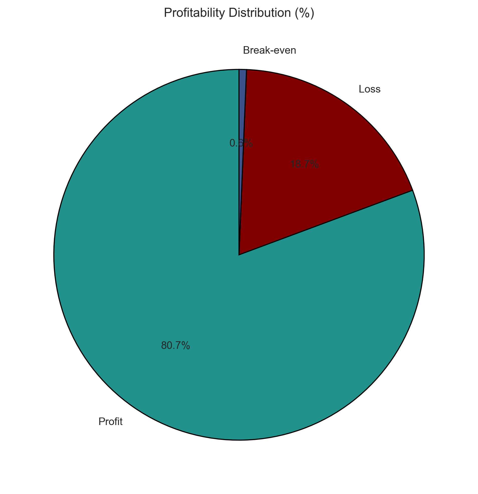
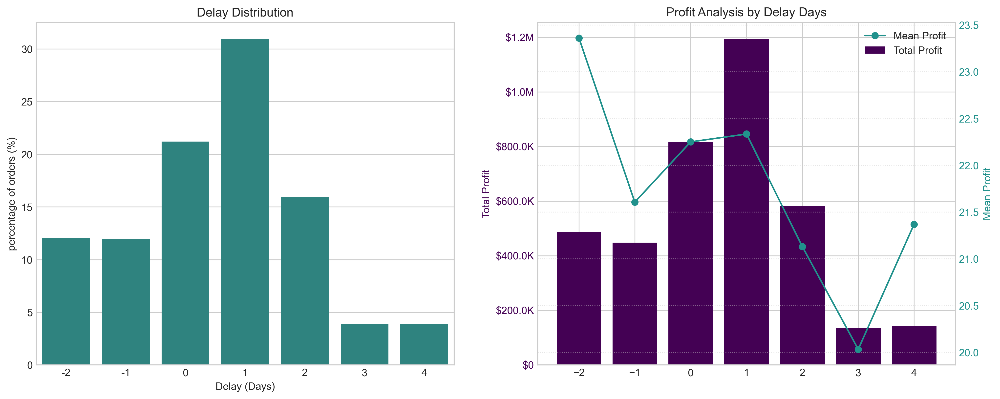
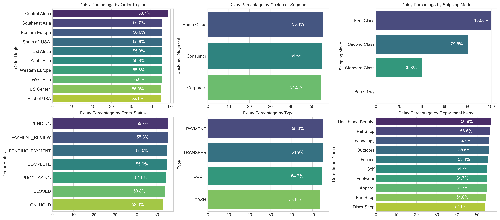
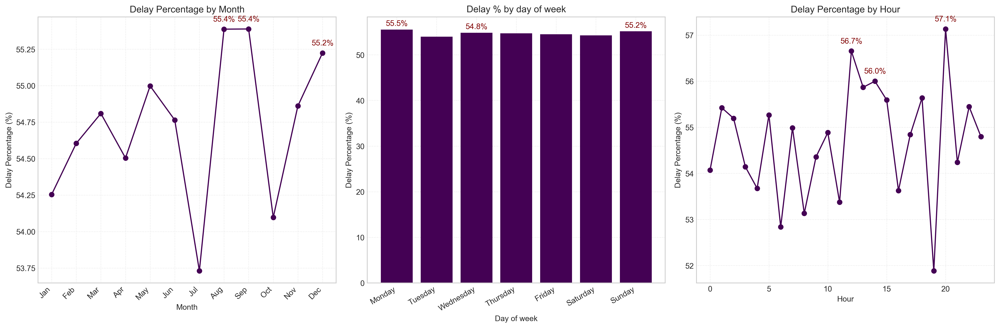

# Supply Chain Analysis — Global E-Commerce Delivery Performance

A data-driven analysis of delivery operations for a global e-commerce platform, covering **172,765 orders** across **January 2015 – January 2018**. The project identifies root causes of chronic late deliveries, quantifies their financial impact, and provides actionable recommendations.

---

## Table of Contents

1. [Executive Summary](#executive-summary)
2. [Key Performance Indicators](#key-performance-indicators)
3. [Profitability Analysis](#profitability-analysis)
4. [Bottleneck Detection](#bottleneck-detection)
5. [Root Cause Analysis](#root-cause-analysis)
6. [Time-Based Analysis](#time-based-analysis)
7. [Strategic Recommendations](#strategic-recommendations)
8. [Conclusion](#conclusion)

---

## Executive Summary

The analysis reveals that **54.71% of all orders are delivered late**, costing the business **$2.1M in at-risk profit** on delayed orders alone. While total profit across fulfilled orders reached **$7.5M**, the persistent late-delivery problem represents both a significant financial drain and a major customer experience risk.

| Metric | Value |
|---|---|
| Overall Late Delivery Rate | 54.71% |
| On-Time Delivery Rate | 45.29% |
| Total Orders Analyzed | 172,765 |
| Total Profit (Profitable Orders) | $7.5M |
| Profit at Risk (Delayed Orders) | $2.1M |

---

## Key Performance Indicators

| KPI | Value |
|---|---|
| Total Orders | 172,765 |
| Late Deliveries | 94,523 |
| Late Delivery % | 54.71% |
| On-Time Delivery % | 45.29% |
| Total Profit (Profitable Orders) | $7.5M |
| Profit at Risk (Delayed Orders) | $2.1M |
| 90th Percentile Delay | 3 days |
| Avg Order Profit | $22.03 |

> **Note:** A 54.71% late delivery rate means more than half of all orders arrive late — this is the default customer experience, not an edge case.

---

## Profitability Analysis

### Profit Distribution

80.7% of orders are profitable, while 18.7% are loss-making — a drag that is disproportionately concentrated among delayed shipments.

### Delay & Profit Analysis

31.0% of all orders arrive exactly **1 day late** — the single largest cohort. Orders delayed by 1–4 days account for 54.7% of total volume, directly mapping to the overall late delivery rate.

> Mean profit per order remains stable at ~$21–$23 across all delay levels. The profitability problem is driven by **volume**, not individual order economics, making systemic throughput improvement the highest-leverage intervention.

---

## Bottleneck Detection

Delay percentage across six operational dimensions reveals where the fulfillment process breaks down most severely.

### Key Findings

| Dimension | Insight |
|---|---|
| **Shipping Mode** | First Class: **100% delay**, Second Class: **79.8%**, Standard Class: **39.8%**, Same Day: **0%** — the #1 lever. |
| **Region** | Narrow spread (55–59%) — confirms a company-wide systemic issue, not a localized failure. |
| **Customer Segment** | All segments (Consumer, Corporate, Home Office) experience nearly identical delay rates (54.5–55.4%). |
| **Department** | Health & Beauty (56.9%) and Pet Shop (56.6%) warrant inventory and carrier audits. |

---

## Root Cause Analysis

Central Africa (58.7% delay rate — the highest region) was selected for deep-dive root cause analysis.

---

## Time-Based Analysis

Delay rates are relatively stable across months, days, and hours (53–57%), but specific peaks highlight opportunities for targeted capacity planning.

### Key Observations

- **Peak Months:** August & September (55.4%), December (55.2%) — mid-year promotions and Q4 holiday surge overwhelm fulfillment capacity.
- **Day of Week:** Minimal variance (<1% spread) — not a meaningful lever.
- **Inter-Day Peaks:** Hour 21 (57.1%), Hour 11 (56.7%), Hour 12 (56%) — late evening and midday bottlenecks.

---

## Strategic Recommendations

| Priority | Recommendation |
|---|---|
| 🔴 **Critical** | Audit First Class & Second Class shipping capacity immediately. First Class has a **100% delay rate**. Consider suspending or repricing until resolved. |
| 🟠 **High** | Resolve payment processing bottlenecks. Orders in PAYMENT_REVIEW (55.3% overall, 80% in Central Africa) and PENDING_PAYMENT (55%) have significantly elevated delay rates. |
| 🟡 **Medium** | Develop seasonal surge capacity plans for August, October, and December. |
| 🟡 **Medium** | Default eligible orders to Standard Class (39.8% delay rate) — far superior to premium modes. |
| 🟡 **Medium** | Audit warehouse-level operations for Outdoors (61.3%) and Golf (90.8%) in Central Africa. |
| ⚪ **Low** | Review pricing and discount policies for the 18.7% loss-making order share. |

---

## Conclusion

This analysis has surfaced a clear and urgent picture: a global e-commerce operation where the **majority of orders (54.71%) fail to meet their promised delivery windows**, costing **$2.1M in at-risk profit** and undermining customer trust at scale.

The root causes are identifiable and addressable:
- **Shipping mode misconfiguration** (First Class 100% late, Second Class 79.8% late) is the dominant operational failure.
- **Payment processing friction** creates a secondary bottleneck.
- **Seasonal volume spikes** are not adequately planned for.
- **Geographic disparities**, while present, are secondary to the systemic company-wide pattern.

---

*Analysis conducted on 172,765 orders spanning January 2015 – January 2018.*
